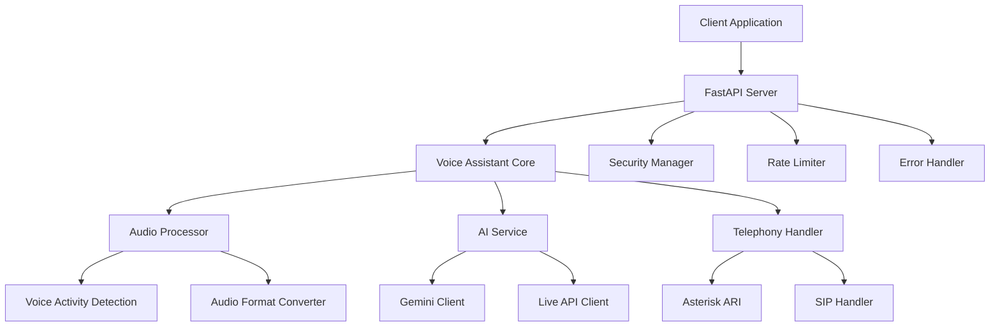

# 📚 NPCL Voice Assistant - API Documentation

## 🎯 Overview

The NPCL Voice Assistant provides a comprehensive API for voice-based interactions with power utility services. This documentation covers all available endpoints, configuration options, and integration patterns.

## 🏗️ Architecture



## 🔧 Configuration

### Environment Variables

| Variable | Type | Required | Default | Description |
|----------|------|----------|---------|-------------|
| `GOOGLE_API_KEY` | string | ✅ | - | Google AI API key |
| `GEMINI_MODEL` | string | ❌ | `gemini-1.5-flash` | Gemini model for text |
| `GEMINI_LIVE_MODEL` | string | ❌ | `gemini-1.5-flash` | Gemini Live API model |
| `GEMINI_VOICE` | string | ❌ | `Puck` | Voice for Live API |
| `ASSISTANT_NAME` | string | ❌ | `Tatiana` | Assistant name |
| `AUDIO_SAMPLE_RATE` | integer | ❌ | `16000` | Audio sample rate (Hz) |
| `AUDIO_CHUNK_SIZE` | integer | ❌ | `320` | Audio chunk size (samples) |
| `VAD_ENERGY_THRESHOLD` | integer | ❌ | `300` | Voice activity threshold |
| `MAX_CALL_DURATION` | integer | ❌ | `3600` | Max call duration (seconds) |

### Audio Configuration

```python
from voice_assistant.core.constants import AudioConstants

audio_config = {
    "sample_rate": AudioConstants.SAMPLE_RATE_16KHZ,
    "channels": AudioConstants.CHANNELS_MONO,
    "format": "slin16",
    "chunk_size": AudioConstants.CHUNK_SIZE_20MS
}
```

## 🌐 REST API Endpoints

### Health Check

**GET** `/health`

Check service health and status.

**Response:**
```json
{
    "status": "healthy",
    "timestamp": "2024-01-15T10:30:00Z",
    "version": "1.0.0",
    "components": {
        "ai_service": "healthy",
        "audio_processor": "healthy",
        "telephony": "healthy"
    }
}
```

### Voice Interaction

**POST** `/voice/interact`

Process voice input and return AI response.

**Request:**
```json
{
    "audio_data": "base64_encoded_audio",
    "format": "wav",
    "session_id": "session_123",
    "user_id": "user_456"
}
```

**Response:**
```json
{
    "response_text": "Hello! How can I help you with your power connection?",
    "audio_response": "base64_encoded_audio",
    "session_id": "session_123",
    "processing_time_ms": 1250,
    "confidence": 0.95
}
```

### Text Interaction

**POST** `/text/interact`

Process text input and return AI response.

**Request:**
```json
{
    "text": "I have a power outage in my area",
    "session_id": "session_123",
    "user_id": "user_456"
}
```

**Response:**
```json
{
    "response_text": "I understand you're experiencing a power outage. Let me help you with that. Could you please provide your connection details?",
    "session_id": "session_123",
    "processing_time_ms": 800
}
```

### Session Management

**POST** `/session/create`

Create a new conversation session.

**Request:**
```json
{
    "user_id": "user_456",
    "mode": "voice",
    "language": "en"
}
```

**Response:**
```json
{
    "session_id": "session_789",
    "created_at": "2024-01-15T10:30:00Z",
    "expires_at": "2024-01-15T11:30:00Z",
    "mode": "voice"
}
```

**GET** `/session/{session_id}/status`

Get session status and information.

**Response:**
```json
{
    "session_id": "session_789",
    "status": "active",
    "created_at": "2024-01-15T10:30:00Z",
    "last_activity": "2024-01-15T10:35:00Z",
    "message_count": 5,
    "mode": "voice"
}
```

**DELETE** `/session/{session_id}`

End a conversation session.

**Response:**
```json
{
    "session_id": "session_789",
    "status": "ended",
    "duration_seconds": 300,
    "message_count": 5
}
```

### Audio Processing

**POST** `/audio/process`

Process raw audio data.

**Request:**
```json
{
    "audio_data": "base64_encoded_audio",
    "format": "pcm16",
    "sample_rate": 16000,
    "operation": "transcribe"
}
```

**Response:**
```json
{
    "transcription": "I need help with my electricity bill",
    "confidence": 0.92,
    "processing_time_ms": 500,
    "detected_language": "en"
}
```

### Configuration

**GET** `/config/audio`

Get current audio configuration.

**Response:**
```json
{
    "sample_rate": 16000,
    "channels": 1,
    "format": "slin16",
    "chunk_size": 320,
    "vad_threshold": 300
}
```

**PUT** `/config/audio`

Update audio configuration.

**Request:**
```json
{
    "vad_threshold": 500,
    "chunk_size": 640
}
```

## 🔌 WebSocket API

### Real-time Voice Interaction

**WebSocket** `/ws/voice/{session_id}`

Real-time voice interaction with streaming audio.

**Connection:**
```javascript
const ws = new WebSocket('ws://localhost:8000/ws/voice/session_123');
```

**Message Types:**

#### Audio Data
```json
{
    "type": "audio_data",
    "data": "base64_encoded_audio",
    "timestamp": 1642248600000
}
```

#### Voice Activity
```json
{
    "type": "voice_activity",
    "is_speaking": true,
    "energy": 1250,
    "timestamp": 1642248600000
}
```

#### AI Response
```json
{
    "type": "ai_response",
    "text": "I can help you with that power issue",
    "audio": "base64_encoded_audio",
    "timestamp": 1642248600000
}
```

#### Error
```json
{
    "type": "error",
    "code": "AUDIO_PROCESSING_ERROR",
    "message": "Failed to process audio",
    "timestamp": 1642248600000
}
```

## 🔒 Authentication & Security

### API Key Authentication

Include your API key in the request headers:

```http
Authorization: Bearer your-api-key-here
X-API-Key: your-api-key-here
```

### Rate Limiting

| Endpoint | Rate Limit | Burst Limit |
|----------|------------|-------------|
| `/voice/interact` | 60/minute | 10/minute |
| `/text/interact` | 100/minute | 20/minute |
| `/session/*` | 30/minute | 5/minute |
| WebSocket | 1000 messages/minute | 50/minute |

### Input Validation

All inputs are automatically validated and sanitized:

- **Text**: Max 10,000 characters, XSS protection
- **Audio**: Max 50MB, format validation
- **Session IDs**: Alphanumeric only, 8-128 characters
- **File paths**: Path traversal protection

## 📊 Monitoring & Analytics

### Metrics Endpoint

**GET** `/metrics`

Get system metrics in Prometheus format.

**Response:**
```
# HELP voice_assistant_requests_total Total number of requests
# TYPE voice_assistant_requests_total counter
voice_assistant_requests_total{endpoint="/voice/interact",status="success"} 1234

# HELP voice_assistant_response_time_seconds Response time in seconds
# TYPE voice_assistant_response_time_seconds histogram
voice_assistant_response_time_seconds_bucket{le="0.1"} 100
voice_assistant_response_time_seconds_bucket{le="0.5"} 450
voice_assistant_response_time_seconds_bucket{le="1.0"} 800
```

### Health Monitoring

**GET** `/health/detailed`

Detailed health check with component status.

**Response:**
```json
{
    "status": "healthy",
    "timestamp": "2024-01-15T10:30:00Z",
    "uptime_seconds": 86400,
    "components": {
        "ai_service": {
            "status": "healthy",
            "response_time_ms": 250,
            "last_check": "2024-01-15T10:29:55Z"
        },
        "audio_processor": {
            "status": "healthy",
            "active_sessions": 5,
            "processing_queue": 2
        },
        "database": {
            "status": "healthy",
            "connections": 10,
            "query_time_ms": 15
        }
    },
    "performance": {
        "cpu_usage": 45.2,
        "memory_usage": 67.8,
        "disk_usage": 23.1
    }
}
```

## 🚨 Error Handling

### Error Response Format

```json
{
    "error": {
        "code": "AUDIO_PROCESSING_ERROR",
        "message": "Failed to process audio data",
        "details": {
            "component": "audio_processor",
            "operation": "transcribe",
            "timestamp": "2024-01-15T10:30:00Z"
        },
        "recovery_suggestions": [
            "Check audio format compatibility",
            "Verify audio data is not corrupted",
            "Try reducing audio file size"
        ]
    }
}
```

### Error Codes

| Code | Description | HTTP Status |
|------|-------------|-------------|
| `VALIDATION_ERROR` | Input validation failed | 400 |
| `AUTHENTICATION_ERROR` | Invalid API key | 401 |
| `RATE_LIMIT_ERROR` | Rate limit exceeded | 429 |
| `AUDIO_PROCESSING_ERROR` | Audio processing failed | 422 |
| `AI_API_ERROR` | AI service error | 502 |
| `CONFIGURATION_ERROR` | Configuration invalid | 500 |

## 🔧 SDK Examples

### Python SDK

```python
from voice_assistant_sdk import VoiceAssistantClient

# Initialize client
client = VoiceAssistantClient(
    api_key="your-api-key",
    base_url="http://localhost:8000"
)

# Create session
session = client.create_session(user_id="user_123", mode="voice")

# Send text message
response = client.send_text(
    session_id=session.id,
    text="I have a power outage"
)
print(response.text)

# Send audio
with open("audio.wav", "rb") as f:
    audio_data = f.read()

response = client.send_audio(
    session_id=session.id,
    audio_data=audio_data,
    format="wav"
)
print(response.transcription)
print(response.response_text)
```

### JavaScript SDK

```javascript
import { VoiceAssistantClient } from 'voice-assistant-sdk';

// Initialize client
const client = new VoiceAssistantClient({
    apiKey: 'your-api-key',
    baseUrl: 'http://localhost:8000'
});

// Create session
const session = await client.createSession({
    userId: 'user_123',
    mode: 'voice'
});

// Send text message
const response = await client.sendText({
    sessionId: session.id,
    text: 'I need help with my electricity bill'
});
console.log(response.text);

// WebSocket connection
const ws = client.connectWebSocket(session.id);
ws.onMessage((message) => {
    if (message.type === 'ai_response') {
        console.log('AI Response:', message.text);
    }
});
```

## 🔄 Integration Patterns

### Asterisk Integration

```python
# ARI Event Handler
from voice_assistant.telephony import ARIHandler

ari_handler = ARIHandler(
    base_url="http://localhost:8088/ari",
    username="asterisk",
    password="1234"
)

@ari_handler.on_event("StasisStart")
async def handle_call_start(event):
    channel = event["channel"]
    session = await voice_assistant.create_session(
        user_id=channel["caller"]["number"],
        mode="voice"
    )
    
    # Start voice interaction
    await voice_assistant.start_call_interaction(
        channel_id=channel["id"],
        session_id=session.id
    )
```

### Custom Audio Pipeline

```python
from voice_assistant.audio import AudioProcessor, VoiceActivityDetector

# Custom audio processing
processor = AudioProcessor(
    sample_rate=16000,
    chunk_size=320,
    format="slin16"
)

vad = VoiceActivityDetector(
    energy_threshold=500,
    silence_threshold=0.3
)

async def process_audio_stream(audio_stream):
    async for chunk in audio_stream:
        # Process audio chunk
        processed = await processor.process_chunk(chunk)
        
        # Detect voice activity
        vad_result = vad.process_audio_chunk(processed)
        
        if vad_result["speech_detected"]:
            # Send to AI for processing
            response = await ai_service.process_audio(processed)
            yield response
```

## 📈 Performance Optimization

### Caching

```python
# Redis caching configuration
CACHE_CONFIG = {
    "redis_url": "redis://localhost:6379",
    "default_ttl": 3600,
    "session_ttl": 1800
}

# Cache AI responses
@cache_response(ttl=300)
async def get_ai_response(text: str, context: str):
    return await ai_service.generate_response(text, context)
```

### Load Balancing

```yaml
# Docker Compose load balancing
version: '3.8'
services:
  voice-assistant-1:
    image: voice-assistant:latest
    environment:
      - INSTANCE_ID=1
  
  voice-assistant-2:
    image: voice-assistant:latest
    environment:
      - INSTANCE_ID=2
  
  nginx:
    image: nginx:alpine
    ports:
      - "80:80"
    volumes:
      - ./nginx.conf:/etc/nginx/nginx.conf
```

## 🔍 Troubleshooting

### Common Issues

1. **Audio Processing Errors**
   - Check audio format compatibility
   - Verify sample rate matches configuration
   - Ensure audio data is not corrupted

2. **AI Service Timeouts**
   - Check API key validity
   - Verify quota limits
   - Monitor network connectivity

3. **WebSocket Connection Issues**
   - Check firewall settings
   - Verify WebSocket support
   - Monitor connection limits

### Debug Mode

Enable debug logging:

```python
import logging
logging.getLogger("voice_assistant").setLevel(logging.DEBUG)
```

### Performance Monitoring

```python
# Enable performance logging
from voice_assistant.core import PerformanceMonitor

monitor = PerformanceMonitor()
monitor.start_monitoring()

# Get performance metrics
metrics = monitor.get_metrics()
print(f"Average response time: {metrics['avg_response_time']}ms")
```

## 📞 Support

- **Documentation**: [https://docs.npcl-voice-assistant.com](https://docs.npcl-voice-assistant.com)
- **GitHub Issues**: [https://github.com/npcl/voice-assistant/issues](https://github.com/npcl/voice-assistant/issues)
- **Email Support**: support@npcl-voice-assistant.com
- **Community Forum**: [https://community.npcl-voice-assistant.com](https://community.npcl-voice-assistant.com)

---

*Last updated: January 15, 2024*