# 🏗️ NPCL Voice Assistant - Architecture Documentation

## 🎯 System Overview

The NPCL Voice Assistant is a modern, scalable voice interaction system designed for power utility customer service. It combines real-time audio processing, AI-powered conversation, and telephony integration to provide seamless voice-based customer support.

## 🏛️ High-Level Architecture

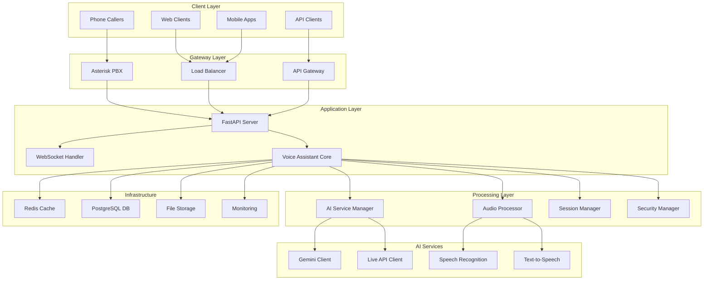

## 🔧 Component Architecture

### Core Components

#### 1. Voice Assistant Core (`src/voice_assistant/core/`)

**Purpose**: Central orchestration and business logic

**Key Classes**:
- `VoiceAssistantCore`: Main orchestrator
- `SessionManager`: Manages conversation sessions
- `ConfigurationManager`: Handles settings and configuration
- `ErrorHandler`: Centralized error handling
- `SecurityManager`: Security and validation

**Responsibilities**:
- Coordinate between audio, AI, and telephony components
- Manage conversation state and context
- Handle security and validation
- Provide unified API interface

#### 2. Audio Processing (`src/voice_assistant/audio/`)

**Purpose**: Real-time audio processing and voice activity detection

**Key Classes**:
- `RealTimeAudioProcessor`: Main audio processing pipeline
- `VoiceActivityDetector`: Detects speech vs silence
- `AudioFormatConverter`: Handles format conversions
- `AudioBuffer`: Manages audio data buffering

**Responsibilities**:
- Process incoming audio streams
- Detect voice activity and speech boundaries
- Convert between audio formats
- Buffer audio for processing

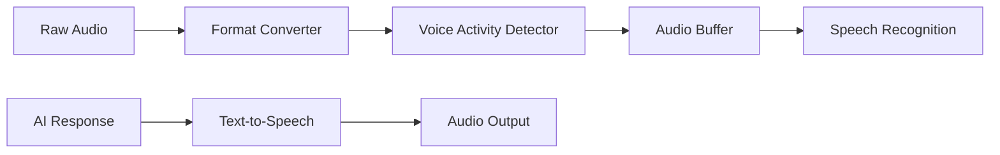

#### 3. AI Services (`src/voice_assistant/ai/`)

**Purpose**: AI-powered conversation and language processing

**Key Classes**:
- `GeminiClient`: Standard Gemini API integration
- `GeminiLiveClient`: Real-time Live API integration
- `ConversationManager`: Manages conversation context
- `ResponseGenerator`: Generates contextual responses

**Responsibilities**:
- Process natural language input
- Generate intelligent responses
- Maintain conversation context
- Handle AI service failover

#### 4. Telephony Integration (`src/voice_assistant/telephony/`)

**Purpose**: Integration with Asterisk PBX and SIP protocols

**Key Classes**:
- `ARIHandler`: Asterisk REST Interface handler
- `CallManager`: Manages active calls
- `SIPHandler`: SIP protocol handling
- `MediaStreamer`: Handles media streaming

**Responsibilities**:
- Handle incoming calls
- Manage call state and media
- Stream audio to/from callers
- Integrate with PBX systems

## 🔄 Data Flow Architecture

### 1. Voice Interaction Flow

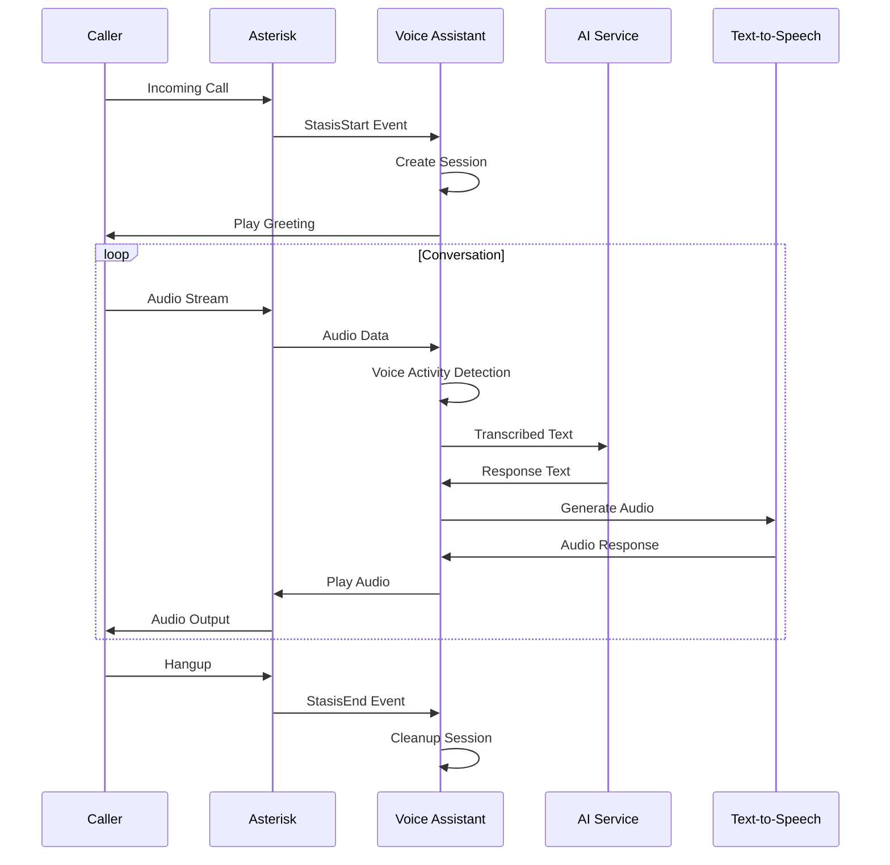

### 2. WebSocket Real-time Flow

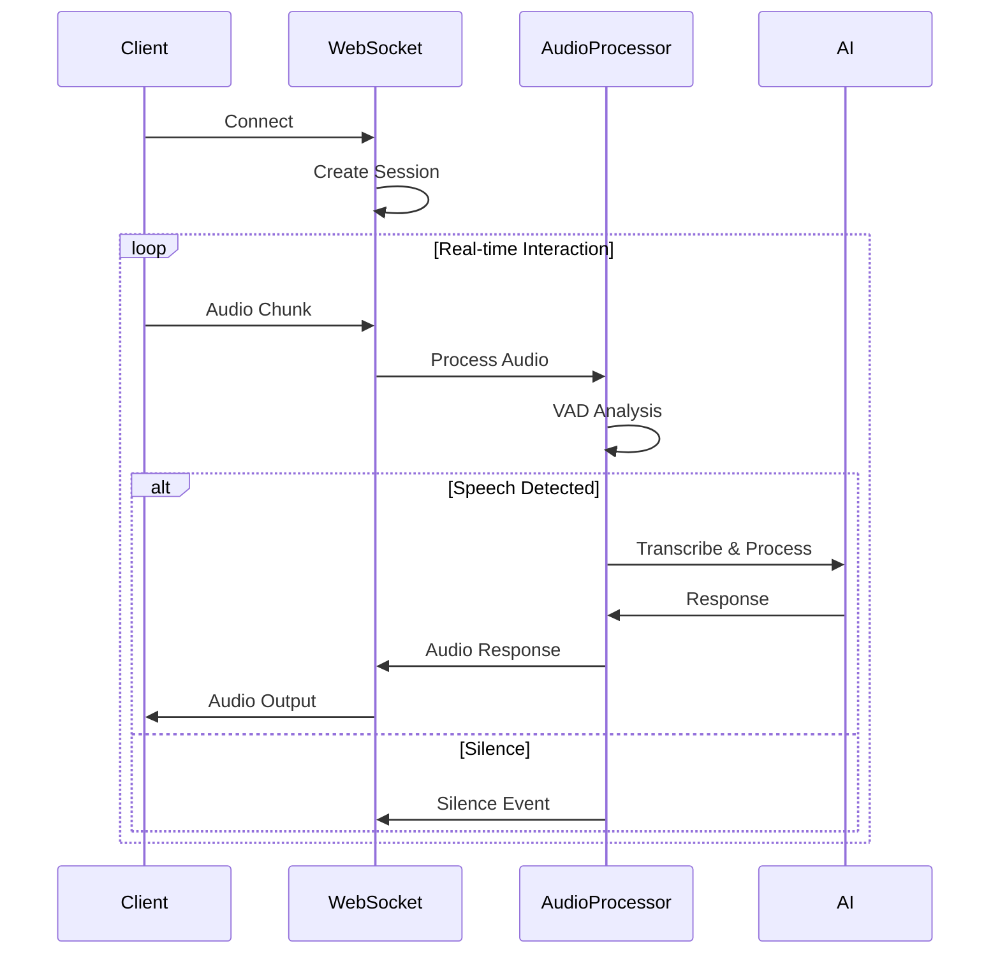

## 🗄️ Data Architecture

### Database Schema

```sql
-- Sessions table
CREATE TABLE sessions (
    id UUID PRIMARY KEY,
    user_id VARCHAR(255),
    status VARCHAR(50),
    mode VARCHAR(50),
    created_at TIMESTAMP,
    updated_at TIMESTAMP,
    expires_at TIMESTAMP,
    metadata JSONB
);

-- Conversations table
CREATE TABLE conversations (
    id UUID PRIMARY KEY,
    session_id UUID REFERENCES sessions(id),
    message_type VARCHAR(50),
    content TEXT,
    metadata JSONB,
    created_at TIMESTAMP
);

-- Audio recordings table
CREATE TABLE audio_recordings (
    id UUID PRIMARY KEY,
    session_id UUID REFERENCES sessions(id),
    file_path VARCHAR(500),
    duration_seconds INTEGER,
    format VARCHAR(50),
    created_at TIMESTAMP
);

-- Performance metrics table
CREATE TABLE performance_metrics (
    id UUID PRIMARY KEY,
    component VARCHAR(100),
    metric_name VARCHAR(100),
    metric_value DECIMAL,
    timestamp TIMESTAMP,
    metadata JSONB
);
```

### Cache Architecture

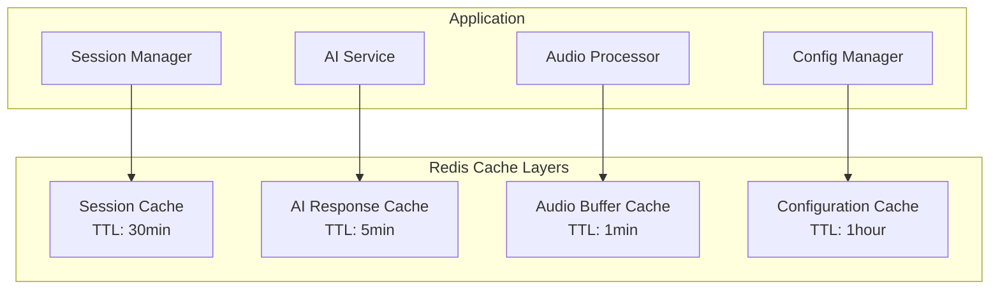

## 🔒 Security Architecture

### Security Layers

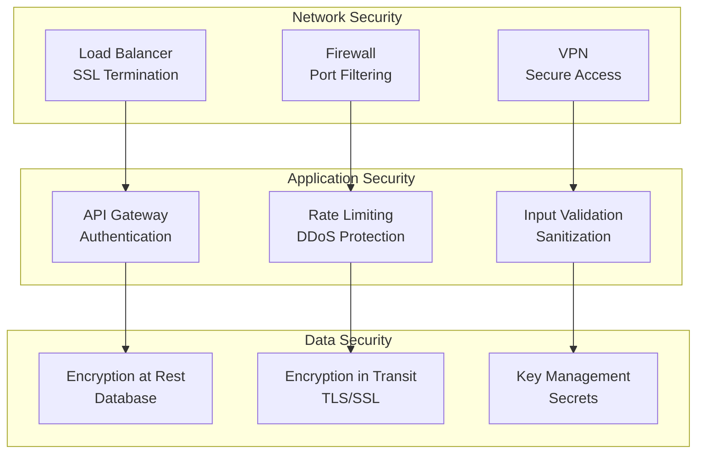

### Authentication Flow

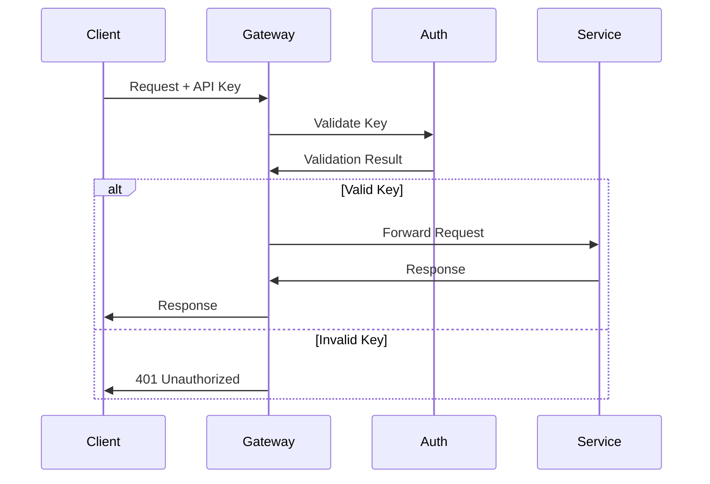

## 📊 Monitoring Architecture

### Observability Stack

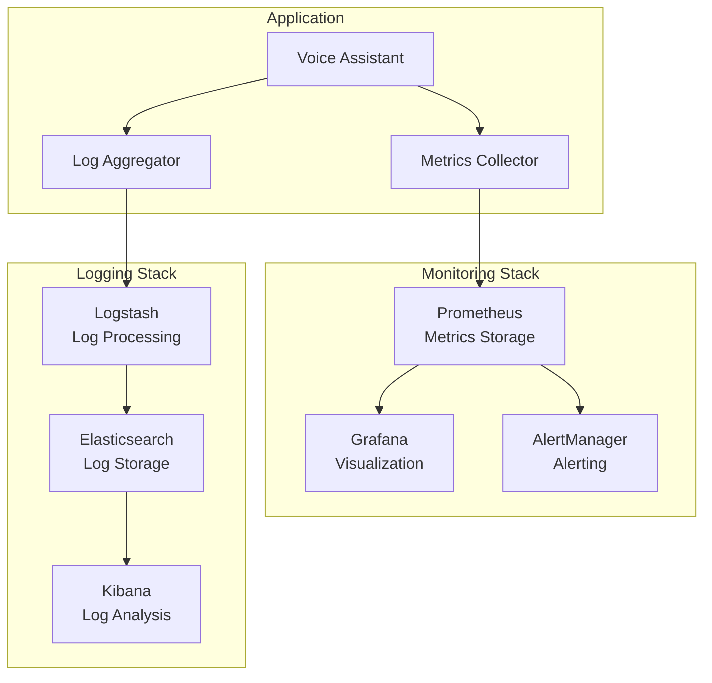

### Key Metrics

| Category | Metrics | Purpose |
|----------|---------|---------|
| **Performance** | Response time, Throughput, Error rate | Monitor system performance |
| **Audio** | Processing latency, VAD accuracy, Audio quality | Monitor audio pipeline |
| **AI** | API response time, Token usage, Model accuracy | Monitor AI services |
| **Telephony** | Call volume, Call duration, Connection quality | Monitor telephony |
| **System** | CPU usage, Memory usage, Disk I/O | Monitor infrastructure |

## 🚀 Deployment Architecture

### Container Architecture

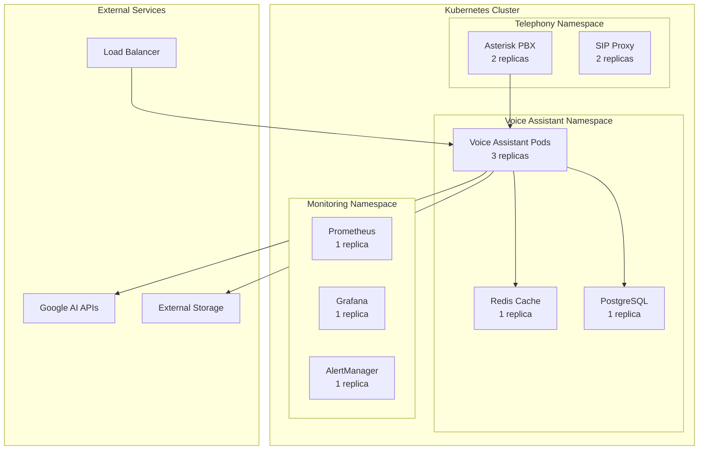

### Scaling Strategy

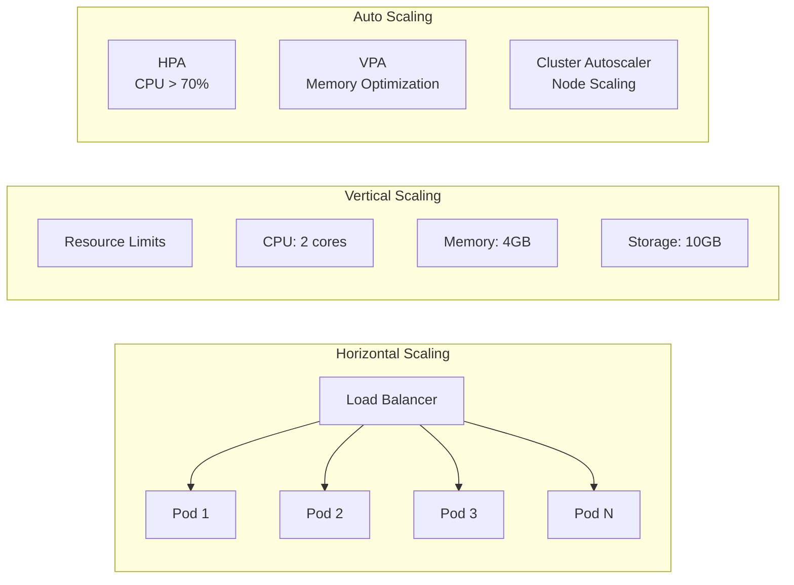

## 🔧 Configuration Architecture

### Configuration Hierarchy

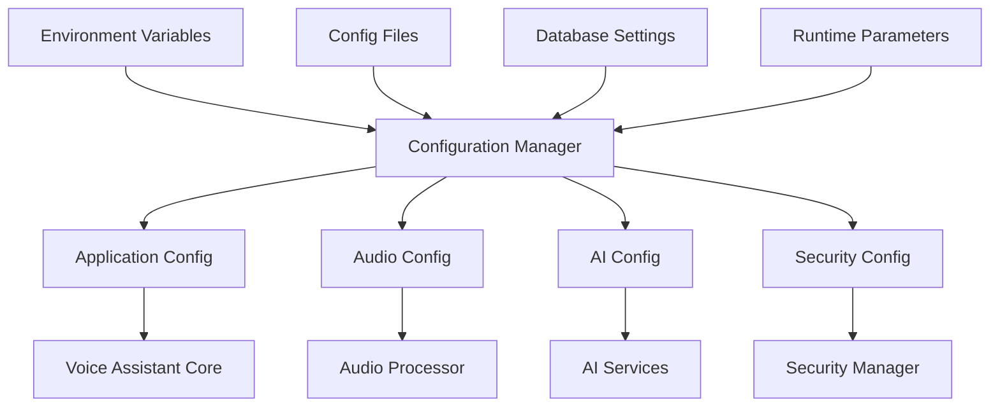

### Configuration Sources Priority

1. **Environment Variables** (Highest priority)
2. **Command Line Arguments**
3. **Configuration Files** (.env, config.yaml)
4. **Database Configuration**
5. **Default Values** (Lowest priority)

## 🔄 Integration Patterns

### Event-Driven Architecture

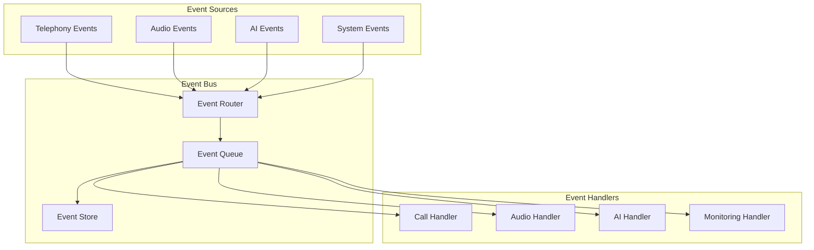

### Plugin Architecture

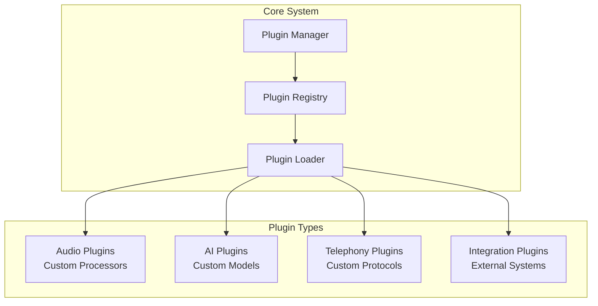

## 📈 Performance Architecture

### Caching Strategy

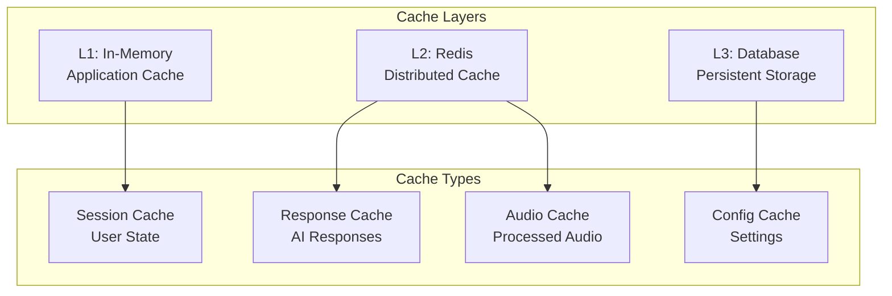

### Load Balancing

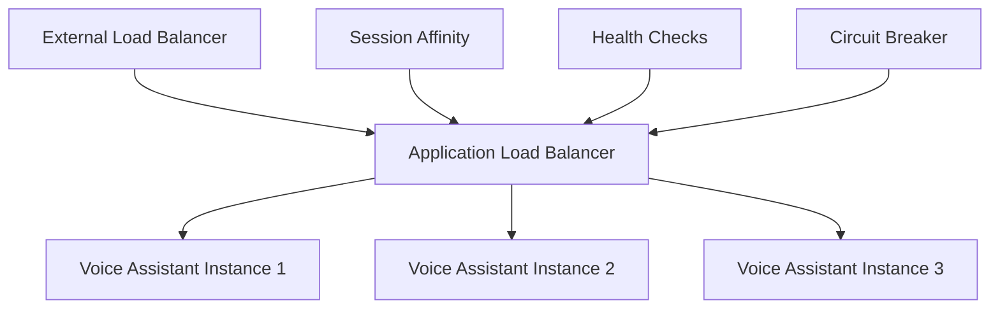

## 🔍 Quality Attributes

### Scalability
- **Horizontal**: Auto-scaling based on load
- **Vertical**: Resource optimization
- **Geographic**: Multi-region deployment

### Reliability
- **Availability**: 99.9% uptime target
- **Fault Tolerance**: Graceful degradation
- **Recovery**: Automatic failover

### Performance
- **Latency**: <500ms response time
- **Throughput**: 1000+ concurrent sessions
- **Efficiency**: Optimized resource usage

### Security
- **Authentication**: API key validation
- **Authorization**: Role-based access
- **Encryption**: End-to-end security

### Maintainability
- **Modularity**: Loosely coupled components
- **Testability**: Comprehensive test coverage
- **Observability**: Full monitoring and logging

---

*This architecture documentation is maintained by the NPCL Voice Assistant development team and is updated with each major release.*